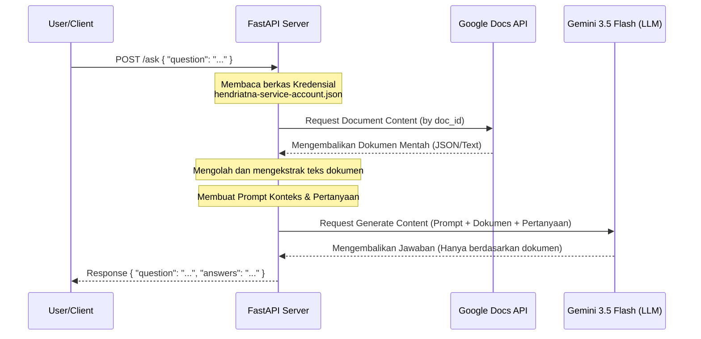

# Chatbot AI - Google Docs & Gemini Q&A System

Project ini adalah sistem Q&A (Question & Answer) berbasis kecerdasan buatan (AI) yang mengintegrasikan dokumen dari **Google Docs** dengan Model Bahasa Besar (LLM) **Gemini 3.5 Flash** menggunakan framework **FastAPI**. Aplikasi ini mengambil isi dokumen dari Google Docs melalui API, mengolah teksnya, dan menyajikan jawaban yang akurat, singkat, dan relevan sesuai isi dokumen tersebut kepada pengguna.

Project ini juga dilengkapi dengan fondasi **RAG (Retrieval-Augmented Generation)** menggunakan **SentenceTransformers** dan **FAISS** untuk pencarian semantik dan reranking dokumen yang efisien.

---

## 🛠️ Tech Stack

Sistem ini dibangun dengan beberapa teknologi utama berikut:

*   **Python**: Bahasa pemrograman utama yang digunakan.
*   **FastAPI**: Web framework modern, cepat (high-performance), untuk membangun RESTful API dengan Python.
*   **Uvicorn**: Server ASGI berkinerja tinggi untuk menjalankan aplikasi FastAPI.
*   **Google GenAI SDK (`google-genai`)**: SDK terbaru dari Google untuk berinteraksi dengan model **Gemini 3.5 Flash**.
*   **Google Docs API & Google Auth**: Digunakan untuk mengakses Google Docs secara aman menggunakan akun layanan (*Service Account*).
*   **FAISS (`faiss-cpu`)**: Library buatan Facebook Research untuk pencarian kemiripan (*similarity search*) dan pengelompokan vektor yang padat secara efisien.
*   **Sentence-Transformers**: Menggunakan model `sentence-transformers/all-MiniLM-L6-v2` untuk mengubah teks dokumen menjadi representasi vektor (embeddings).
*   **NumPy**: Untuk operasi manipulasi array vektor matematika tingkat lanjut.

---

## 🔄 Alur Aplikasi (Application Flow)

Aplikasi berjalan dengan mengikuti alur sebagai berikut:



### Detail Alur Kerja:
1.  **Penerimaan Request**: User mengirimkan pertanyaan melalui endpoint `/ask` dalam bentuk JSON payload.
2.  **Autentikasi & Ambil Dokumen**: FastAPI melakukan autentikasi ke Google Cloud menggunakan file Service Account (`hendriatna-service-account.json`) dan membaca konten Google Docs secara real-time berdasarkan `documentId` yang ditentukan.
3.  **Ekstraksi Teks**: Server melakukan ekstraksi paragraf, teks, serta elemen dalam Google Docs.
4.  *(Opsional - Fitur RAG Terintegrasi)*: Project ini memiliki modul pembagian dokumen berdasarkan Heading (`parse_sections`), pembuatan indeks semantik (`build_faiss_index`), dan pencarian semantik dengan reranking berbasis Cosine Similarity (`search`) jika ingin dikembangkan menjadi pencarian dokumen skala besar.
5.  **Injeksi Prompt**: Konten dokumen dimasukkan ke dalam template prompt khusus yang membatasi model agar hanya menjawab menggunakan informasi dari dokumen tersebut.
6.  **Inference LLM**: Prompt dikirimkan ke model **Gemini 3.5 Flash** menggunakan API Key Gemini.
7.  **Response**: Jawaban dari Gemini dikirimkan kembali kepada User secara langsung.

---

## ⚙️ Cara Install Environment

Ikuti langkah-langkah di bawah ini untuk menyiapkan lingkungan pengembangan (environment) di komputer Anda (Windows):

### 1. Clone atau Buka Folder Project
Pastikan Anda berada di direktori root dari project ini:
```powershell
cd "..\chatboot-ai"
```

### 2. Membuat Virtual Environment (venv)
Buat environment Python baru untuk mengisolasi dependensi agar tidak bentrok dengan sistem global:
```powershell
python -m venv .venv
```

### 3. Aktivasi Virtual Environment
*   **Di Windows (PowerShell)**:
    ```powershell
    .venv\Scripts\Activate.ps1
    ```
*   **Di Windows (Command Prompt - CMD)**:
    ```cmd
    .venv\Scripts\activate.bat
    ```
*   **Di macOS / Linux**:
    ```bash
    source .venv/bin/activate
    ```

### 4. Install Dependensi
Install seluruh library yang tertera di file `requirements.txt`:
```powershell
pip install -r requirements.txt
```

*(Catatan: Jika file `requirements.txt` terdeteksi dalam format encoding UTF-16, Anda dapat menginstal dependensi utama secara manual menggunakan perintah berikut jika terjadi kendala membaca file):*
```powershell
pip install fastapi uvicorn requests google-api-python-client google-auth-httplib2 google-auth-oauthlib google-genai faiss-cpu numpy sentence-transformers
```

---

## 🔑 Konfigurasi Kredensial & API Key

Sebelum menjalankan aplikasi, pastikan berkas-berkas kredensial berikut sudah tersedia di root direktori project:

1.  **Google Service Account**: File `service-account.json` harus diletakkan di root folder project. Akun layanan ini wajib memiliki akses pembacaan (Viewer/Reader) terhadap file Google Docs yang ingin diakses.
2.  **Gemini API Key**: Di dalam file `read_docs.py`, pastikan API Key Gemini yang aktif terpasang pada inisialisasi client:
    ```python
    client = genai.Client(api_key="API_KEY_GEMINI_ANDA")
    ```

---

## 🚀 Cara Running Aplikasi

Setelah setup environment selesai, Anda dapat menjalankan server FastAPI dengan langkah-langkah berikut:

### 1. Jalankan Server FastAPI menggunakan Uvicorn
Jalankan perintah ini di terminal (pastikan `.venv` dalam keadaan aktif):
```powershell
uvicorn read_docs:app --reload
```
Opsi `--reload` membuat server otomatis mendeteksi perubahan kode dan melakukan restart tanpa perlu dijalankan ulang secara manual.

Output sukses akan terlihat seperti ini di terminal Anda:
```text
INFO:     Started server process [12345]
INFO:     Waiting for application startup.
INFO:     Application startup complete.
INFO:     Uvicorn running on http://127.0.0.1:8000 (Press CTRL+C to quit)
```

### 2. Uji Coba API (Testing)

#### Menggunakan Swagger UI (Rekomendasi)
Buka browser Anda dan akses:
👉 **[http://127.0.0.1:8000/docs](http://127.0.0.1:8000/docs)**

Anda dapat langsung melakukan ujicoba interaktif dengan menekan tombol **"Try it out"** pada endpoint `POST /ask`, isi request body, lalu tekan **"Execute"**.

#### Menggunakan cURL (melalui Terminal / CMD)
```bash
curl -X POST "http://127.0.0.1:8000/ask" \
     -H "Content-Type: application/json" \
     -d "{\"question\": \"Apa kesimpulan dari dokumen tersebut?\"}"
```

#### Contoh Request Body:
```json
{
  "question": "Sebutkan poin penting dalam pembahasan ini!"
}
```

#### Contoh Response:
```json
{
  "question": "Sebutkan poin penting dalam pembahasan ini!",
  "answers": "Berikut adalah poin penting dari dokumen: 1. Poin A... 2. Poin B..."
}
```
